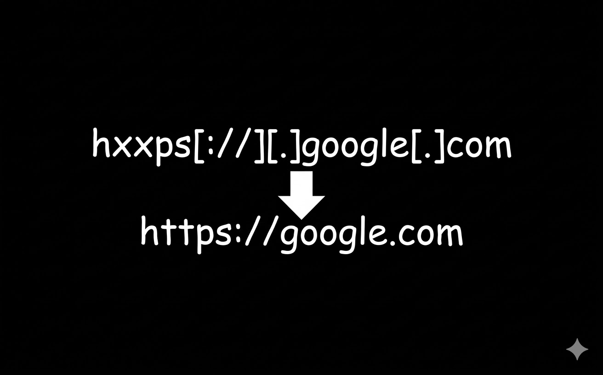

# hxxps

Ever see someone post a link as `hxxps://example.com` instead of `https://example.com`? That's defanging. People do it when they're sharing links in security reports, forums, or anywhere they want to make sure you don't accidentally click something suspicious. Problem is, now you can't click it. That's what this extension fixes.

One click converts the link to something you can actually use. Handles both `hxxps` and `hxxp` variations without impacting performance.

## What it does

- Converts obfuscated links with one click
- Works with both hxxps and hxxp formats
- Lightweight with minimal performance impact
- Respects your privacy, no tracking or data collection

## How to install it

1. Clone or download this repo
2. Open Chrome and head to `chrome://extensions/`
3. Turn on "Developer mode" in the top right
4. Click "Load unpacked" and pick this folder
5. That's it.

## License

GPLv3. Check the [LICENSE](LICENSE) file if you want the details.
